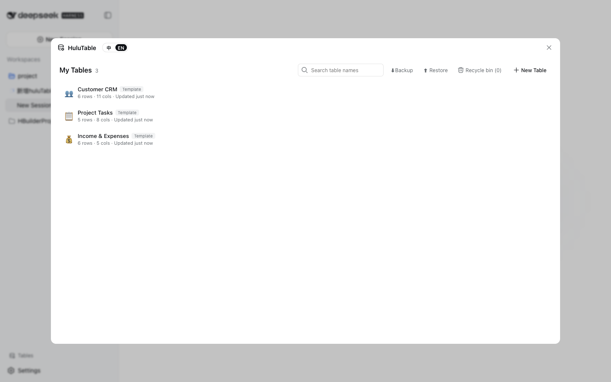
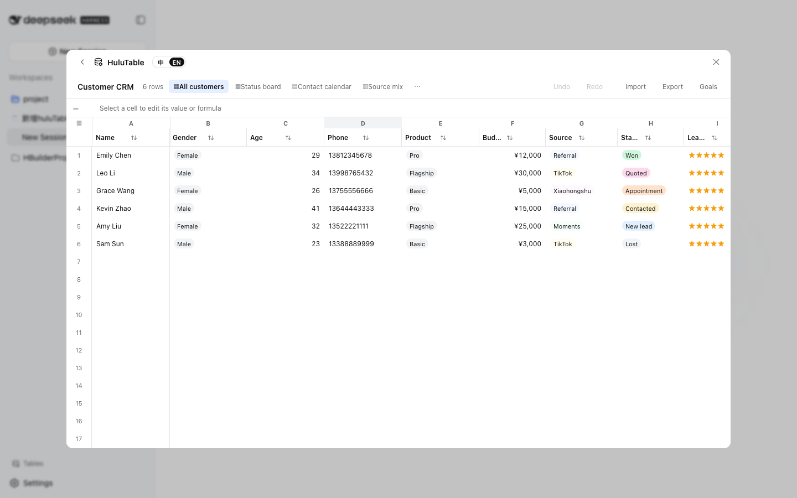
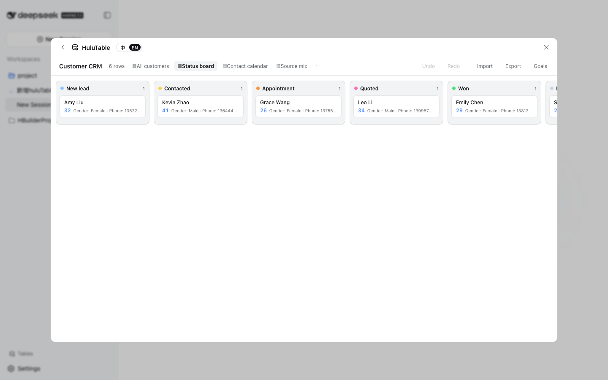
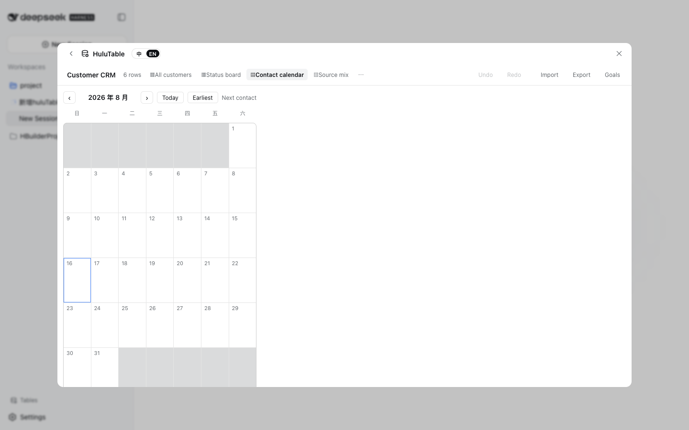
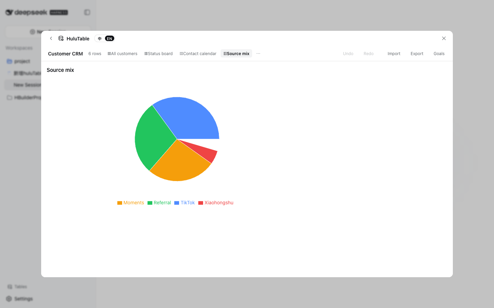
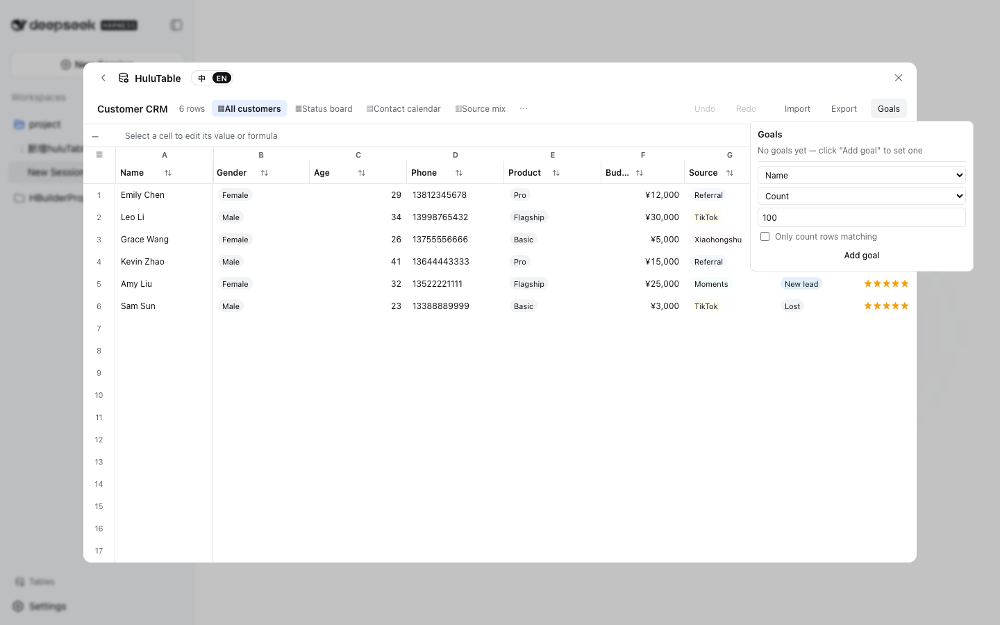
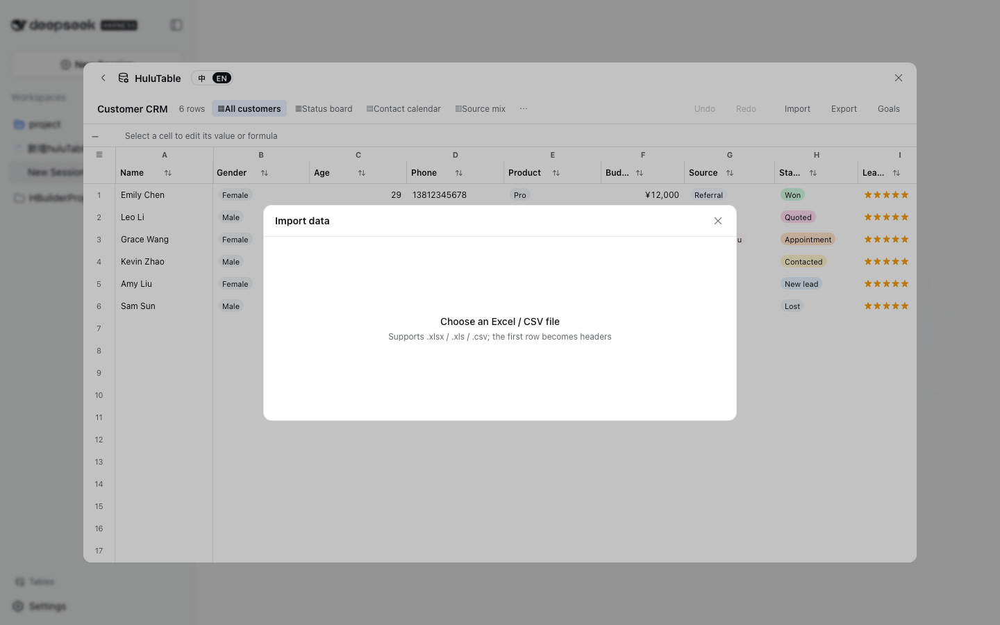
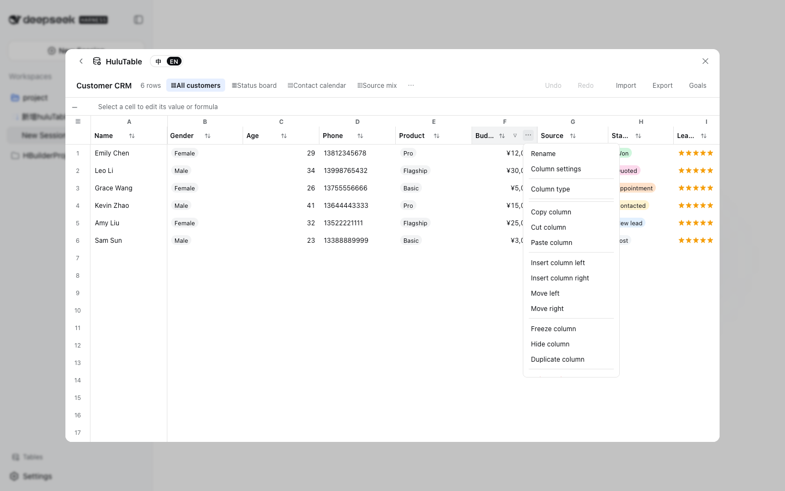

# huluTable

> A DeepSeek Harness Web client plugin: a "Tables" trigger in the sidebar footer plus a full-viewport table workspace — foolproof online-table data management.
> No database, no server: all data lives in the browser's IndexedDB and works out of the box. Current release: **v0.1**.

[中文](./README.zh.md) · [License](./LICENSE) · [Changelog](./CHANGELOG.md) · [Pre-release checklist](./docs/OPEN-SOURCE-CHECKLIST.md)

huluTable brings an online spreadsheet into DeepSeek Harness: a table library, a virtualized grid editor, 18 column types, formulas, filters and sorts, kanban/calendar/chart views, Excel import/export and more. Double-click a cell to edit, drag the corner to fill series, right-click for row/column menus — every change is undoable.

## Screenshots

| Table library | Grid editor |
|---|---|
|  |  |

| Kanban | Calendar | Chart |
|---|---|---|
|  |  |  |

| Goals | Excel import | Column menu |
|---|---|---|
|  |  |  |

## Features

| Area | Capabilities |
|---|---|
| Table library | List/search/tags/stars; create blank or from 6 templates (Customer CRM, Projects, Finance ledger, Attendance, To-dos, Inventory); rename/duplicate/delete; recycle bin (30-day TTL); **one-click JSON backup/restore** |
| Grid editor | Virtual scrolling (10k+ rows); double-click editing; drag-select / Shift-extend; copy-paste (Excel TSV included); fill drag (increment/decrement/series/copy); delta-level undo/redo; **long-press drag to reorder rows/columns**; **row/column copy, cut, paste**; row/column context menus |
| Columns | 18 column types; column settings panel (required/default/width/freeze/hide/description); **format validation** (phone/email/url/number/length/regex); **dropdown options with background colors**; **linked selects** (map/source modes); single-click dropdown pickers; **edge drag resizing**; **frozen columns** (positional — the freeze follows reorders) |
| Filter & sort | Header filters (text/number/multi-select dropdown/color); multi-level sorts (Shift stacks); AND/OR filter combinations; one-click clear |
| Stats | Bottom stats bar (sum/average/max/min/count); **per-column goal progress bars** (header chips + goals panel) |
| Formulas | fx bar; 30+ built-ins (SUM/AVERAGE/IF/CONCAT/TODAY/ROUND…); cell/range references; automatic recalculation; template quick-inserts |
| Views | Grid / **Kanban** (grouped by a dropdown column, drag cards = CRM funnel) / **Calendar** (month view on a date column, jump to earliest date) / **Chart** (bar/pie/funnel); view management (create/duplicate/rename/delete, bound columns) |
| Conditional formatting | Row/column-scope rules (equals/range/contains… coloring), managed from the column settings |
| Import/export | `.xlsx` / `.csv` export (whole table or filtered rows); import (header detection + type inference + preview + create/append) |
| Collaboration traces | **Per-cell edit history** (last 5, hover to view); **cell comments** (badge + popover add/edit/delete) |
| Usability | Chinese/English UI; empty-state guidance; sticky header; row numbers and frozen columns stay pinned on horizontal scroll |

## Installation

huluTable is a DeepSeek Harness **bundle**: an npm package carrying a patch configuration layer (`dsh.bundle.patch`). Prerequisites: the `dsh` CLI installed, and a profile that includes `@deepseek-ai/dsh-web-app` (the web surface).

### Option 1 — local checkout (development / trying it out)

```sh
dsh plugin --profile web add /path/to/HuluTable
dsh web                          # open http://127.0.0.1:3080
```

### Option 2 — install from GitHub (source + automatic build)

```sh
dsh plugin --profile web add github:huluwocom/HuluTable
```

This repository's `prepare` script builds `lib/` straight from `src/` (self-contained transpilation — no monorepo, no type-checking). pnpm ≥10 refuses to run git dependencies' build scripts until you allow it: copy the exact package key `dsh` prints into that profile's `pnpm-workspace.yaml`:

```yaml
allowBuilds:
  dsh-hulutable-plugin: true
```

Then re-run `add`. Consider pinning a commit (`github:you/HuluTable#<sha>`) so later pushes cannot silently change what runs.

### Option 3 — tarball (prebuilt, no build permission needed)

```sh
dsh plugin --profile web add ./releases/dsh-hulutable-plugin-0.1.0.tgz
```

The `releases/` directory ships a `pnpm pack` artifact plus its SHA-256 checksum; you can also `pnpm pack` yourself.

> Note: the `dsh-web-app` bundle ships a built-in `ui-hulutable` row pointing at the monorepo workspace package. This bundle's `cordis.patch.yml` **disables the built-in row** and **inserts an independent row** (patches cannot rename a row, hence disable+insert), so the standalone version takes effect after installation. Once published to npm, `dsh plugin --profile web add dsh-hulutable-plugin` is equivalent to the three options above.

## Development

```sh
pnpm install            # installs deps; prepare runs the build automatically (tsdown → lib/)
pnpm run build          # builds the node half + browser half (lib/index.js, lib/invariant.js, lib/client.js)
pnpm run watch          # rebuild on change
pnpm run pack           # build and pack a tarball into releases/
```

### Type-checking and tests (SDK required)

The `@deepseek-ai/*` SDK packages are not yet published to npm; at runtime the web shell provides the platform modules. Type-checking and the test suite need a local [deepseek-harness](https://github.com/deepseek-ai/deepseek-harness) checkout linked in:

```sh
pnpm link-sdk /path/to/deepseek-harness   # writes link: devDependencies and runs pnpm install
pnpm run typecheck                        # tsc --noEmit
pnpm run test                             # vitest (jsdom)
pnpm run coverage                         # 100% coverage gate
pnpm run lint                             # oxlint
```

The build itself (`prepare` / `build`) needs **no** SDK: type-only imports are erased during transpilation, and cross-plugin value imports are rejected at build time by the purity gate.

## Architecture

```
src/
├── index.ts                 # node half (deliberately empty — all behavior is browser-side)
├── invariant.ts             # package invariant companion (loaded via the "./invariant" export)
└── client/                  # browser half (dsh.client, platform: web)
    ├── index.ts             # registers the hulutable dictionaries + the sidebar.footer.action trigger
    ├── HulutableRoot.tsx    # trigger row + workspace panel shell
    ├── TableLibrary.tsx     # table library home (backup/restore/recycle bin)
    ├── controller.ts        # HulutableController: single snapshot store + every mutation
    ├── persistence.ts       # IndexedDB persistence (debounced batch flush) + in-memory impl
    ├── domain/              # data model, delta undo, editor ops, query engine, formulas, templates, validation
    ├── grid/                # virtualized grid, memoized cells, geometry, menus/filters/pickers/panels
    ├── views/               # kanban / calendar / chart views
    └── io/io.ts             # SheetJS import/export + type inference
```

## Performance & data

- Virtual scrolling: only the visible window (±4 row/column overscan) renders; scrolling is rAF-throttled; cells are `React.memo`.
- Undo is **delta-level** (only changed cells/structure are recorded), independent of table size; formula recomputation touches only formula cells.
- IndexedDB writes are debounced (500ms + immediate on pagehide); storage unavailability (private mode) degrades to in-memory mode.
- First load is about 1.6MB (SheetJS included, ~400KB gzip), then browser-cached.

## License

[MIT](./LICENSE) © 2025 huluTable contributors

Third-party dependencies: `clsx` (MIT), `recharts` (MIT), `xlsx / SheetJS` (Apache-2.0) — see [THIRD_PARTY_NOTICES.md](./docs/THIRD_PARTY_NOTICES.md).
