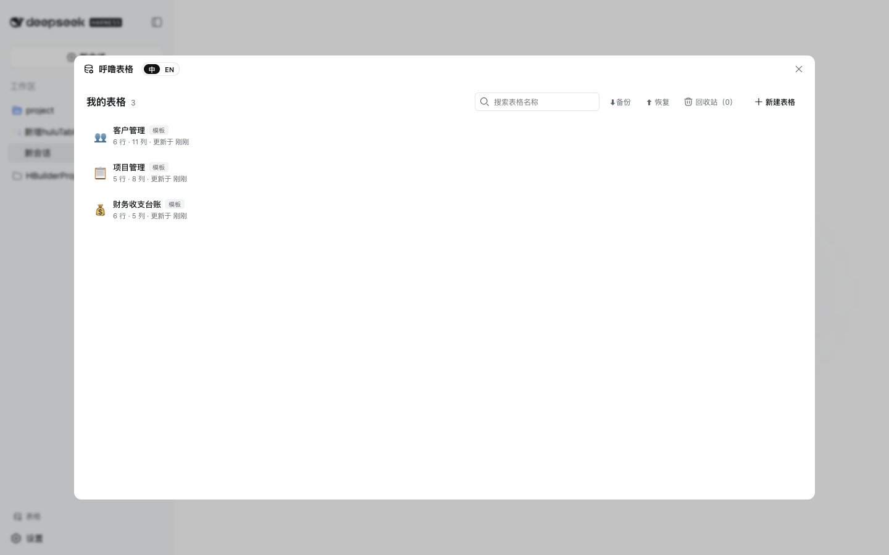
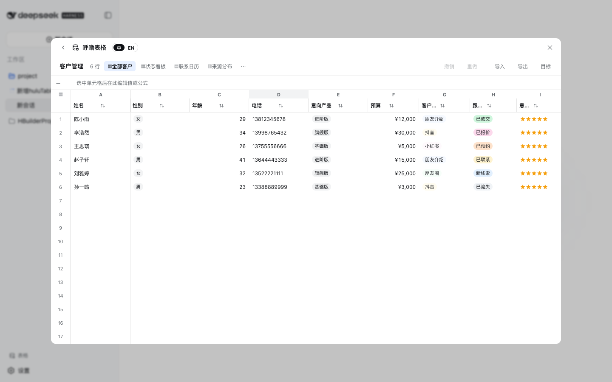
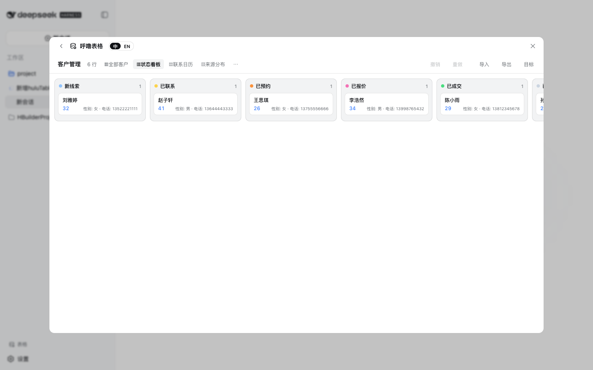
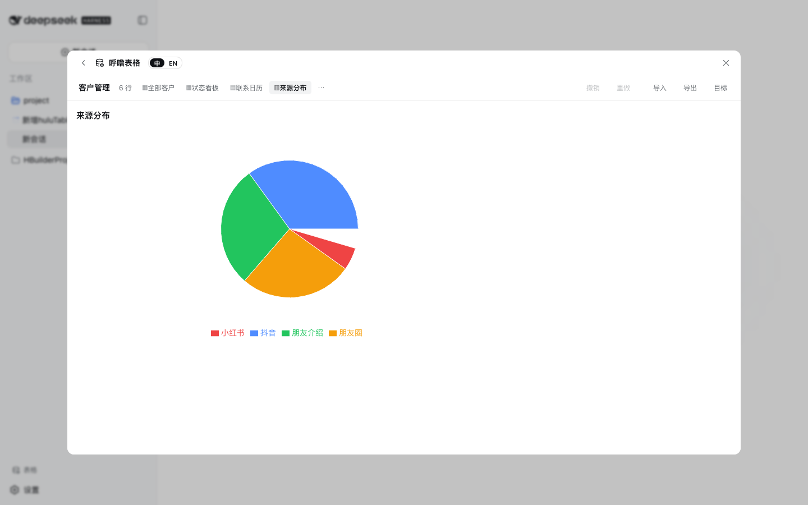
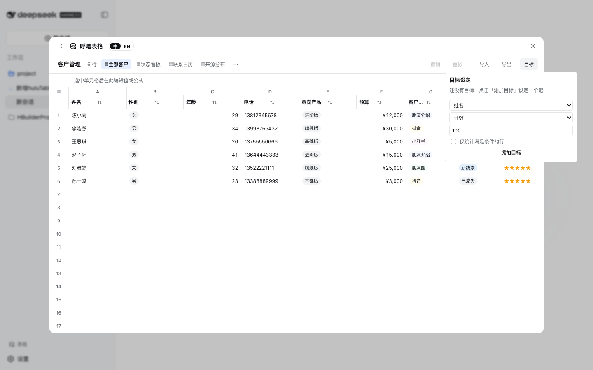
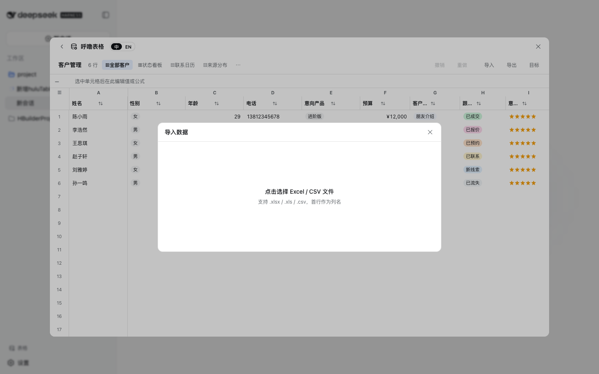
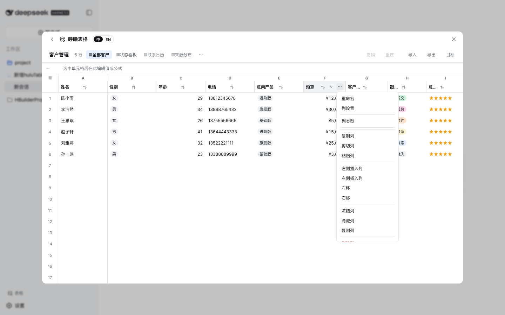

# huluTable · 呼噜表格

> DeepSeek Harness Web 客户端插件：侧边栏「表格」入口 + 全屏表格工作台，提供傻瓜化的在线表格数据管理。
> 无需数据库、无需服务端 —— 所有数据保存在浏览器 IndexedDB，开箱即用。当前版本：**v0.1**。

[English](./README.md) · [许可证](./LICENSE) · [更新日志](./CHANGELOG.md)

huluTable 把「在线表格」装进 DeepSeek Harness：表格库、虚拟滚动网格、16 种列类型、公式、筛选排序、看板/日历/图表视图、Excel 导入导出、自然语言修改表格。双击单元格开始编辑，拖拽填充序列，右键管理行列，所有操作可撤销。

## 核心截图

| 表格库 | 网格编辑器 |
|---|---|
|  |  |

| 看板视图 | 日历视图 | 图表视图 |
|---|---|---|
|  |  |  |

| 目标进度 | Excel 导入 | 列菜单 |
|---|---|---|
|  |  |  |

## 功能总览

| 区域 | 能力 |
|---|---|
| 表格库 | 列表/搜索/标签/星标；新建（空白或 6 个模板：客户管理、项目管理、财务收支台账、员工考勤、任务待办、库存管理）；重命名/复制/删除；回收站（30 天 TTL）；**一键备份/恢复（JSON）** |
| 网格编辑器 | 虚拟滚动（万行级）；双击编辑；拖选/Shift 扩展；复制粘贴（含 Excel TSV）；拖拽填充（递增/递减/序列/复制）；撤销/重做（delta 级）；**长按拖拽调整行/列顺序**；**行/列复制、剪切、粘贴**；行/列右键菜单 |
| 列能力 | 18 种列类型；列设置面板（必填/默认/宽度/冻结/隐藏/说明）；**格式验证**（手机号/邮箱/网址/数字/长度/正则）；**下拉选项带背景色**；**级联联动**（映射/来源两种模式）；下拉单元格单击选择；**列边缘拖拽改宽**；**冻结列**（位置式，随拖动自动转移） |
| 筛选排序 | 列头筛选（文本/数字/下拉多选/颜色）；多级排序（Shift 叠加）；筛选组合 AND/OR；一键清除 |
| 统计 | 底部统计栏（求和/平均/最大/最小/计数）；**列级目标进度条**（表头 + 目标面板） |
| 公式 | fx 公式栏；内置函数（SUM/AVERAGE/IF/CONCAT/TODAY/ROUND 等 30+）；单元格/区域引用；自动重算；公式模板快捷插入 |
| 视图 | 网格 / **看板**（按下拉列分组，拖拽卡片流转 = CRM 漏斗）/ **日历**（按日期列月历，一键跳到最早日期）/ **图表**（柱状/饼图/漏斗）；视图管理（新建/复制/重命名/删除、绑定列） |
| 条件格式 | 行/列作用域规则（等于/区间/包含…着色），规则管理入口在列设置 |
| 导入导出 | `.xlsx` / `.csv` 导出（当前表或筛选结果）；导入（表头识别 + 类型推断 + 预览 + 新建/追加） |
| 协作痕迹 | **单元格修改历史**（最近 5 次，hover 查看）；**单元格批注**（角标 + 弹层增删改） |
| 易用性 | 中英双语界面；空状态引导；顶部固定表头；水平滚动时行号/冻结列钉住 |

## 安装说明

huluTable 是一个 DeepSeek Harness **组合包（bundle）**：npm 包 + 一个 patch 配置层（`dsh.bundle.patch`）。前提：已安装 `dsh` CLI，且目标 profile 包含 `@deepseek-ai/dsh-web-app`（Web 界面）。

### 方式一：本地 checkout（开发、体验）

```sh
dsh plugin --profile web add /path/to/HuluTable
dsh web                          # 打开 http://127.0.0.1:3080
```

### 方式二：从 GitHub 安装（源码 + 自动构建）

```sh
dsh plugin --profile web add github:huluwocom/HuluTable
```

本仓库的 `prepare` 脚本会从源码直接构建出 `lib/`（自包含转译，无需 monorepo、无需类型检查）。pnpm ≥10 需要为 git 依赖授权构建脚本：按 `dsh` 打印的提示，把对应包键加入该 profile 的 `pnpm-workspace.yaml`：

```yaml
allowBuilds:
  dsh-hulutable-plugin: true
```

然后重新执行 `add`。建议锁定 commit（`github:you/HuluTable#<sha>`）以固定实际运行的代码。

### 方式三：tarball（预构建，无需构建授权）

```sh
dsh plugin --profile web add ./releases/dsh-hulutable-plugin-0.1.0.tgz
```

仓库 `releases/` 目录自带 `pnpm pack` 产物与 SHA-256 校验和；也可自行 `pnpm pack`。

> 说明：`dsh-web-app` 组合包内置了一行指向 monorepo 工作区包的 `ui-hulutable` 配置。本组合包的 `cordis.patch.yml` 会**禁用内置行**并**插入独立包行**（补丁不能改名，故采用禁用+插入），安装后生效的是本仓库的独立版本。发布到 npm 后，`dsh plugin --profile web add dsh-hulutable-plugin` 与上述三种方式等价。

## 开发

```sh
pnpm install            # 安装依赖；prepare 自动执行构建（tsdown → lib/）
pnpm run build          # 构建 node 半部 + 浏览器半部（lib/index.js、lib/invariant.js、lib/client.js）
pnpm run watch          # 监听重建
pnpm run pack           # 构建并打包 tarball 到 releases/
```

### 类型检查与测试（需要 SDK）

插件依赖的 `@deepseek-ai/*` SDK 包暂未发布到 npm，运行时的平台模块由 Web 外壳提供；类型检查与测试需要链接一份本地的 [deepseek-harness](https://github.com/deepseek-ai/deepseek-harness) checkout：

```sh
pnpm link-sdk /path/to/deepseek-harness   # 写入 link: 开发依赖并 pnpm install
pnpm run typecheck                        # tsc --noEmit
pnpm run test                             # vitest（jsdom，48 个文件 / 486 用例）
pnpm run coverage                         # 100% 覆盖率门禁
pnpm run lint                             # oxlint
```

构建本身（`prepare`/`build`）**不需要** SDK：转译期会擦除类型导入，跨插件的值导入在构建期被 purity 门禁拦截。

## 架构

```
src/
├── index.ts                 # node 半部（有意为空：全部行为在浏览器侧）
├── invariant.ts             # 包不变量伴生插件（./invariant 导出，框架自动加载）
└── client/                  # 浏览器半部（dsh.client，platform: web）
    ├── index.ts             # 注册 hulutable 字典 + sidebar.footer.action 触发条目
    ├── HulutableRoot.tsx    # 触发行 + 工作台面板外壳
    ├── TableLibrary.tsx     # 表格库首页（备份/恢复/回收站）
    ├── controller.ts        # HulutableController：单一快照 store + 全部变更方法
    ├── persistence.ts       # IndexedDB 持久化（防抖批量落盘）+ Memory 实现
    ├── domain/              # 数据模型、delta 撤销、编辑器操作、筛选排序、公式、模板、校验
    ├── grid/                # 虚拟滚动网格、memo 单元格、几何计算、菜单/筛选/选择器/设置面板
    ├── views/               # 看板 / 日历 / 图表视图
    └── io/io.ts             # SheetJS 导入导出 + 类型推断
```

## 性能与数据

- 网格虚拟滚动：仅渲染可视窗口（±4 行/列 overscan），滚动 rAF 节流；单元格 `React.memo`。
- 撤销为 **delta 级**（只记录变更单元格/结构），与表大小无关；公式重算只遍历公式单元格。
- IndexedDB 防抖落盘（500ms + pagehide 立即）；存储不可用（隐私模式）时降级为内存模式。
- 首次加载约 1.6MB（含 SheetJS，gzip 约 400KB），随后浏览器缓存。

## 许可证

[MIT](./LICENSE) © 2025 huluTable contributors

第三方依赖：`clsx`（MIT）、`recharts`（MIT）、`xlsx / SheetJS`（Apache-2.0），详见 [THIRD_PARTY_NOTICES.md](./docs/THIRD_PARTY_NOTICES.md)。
